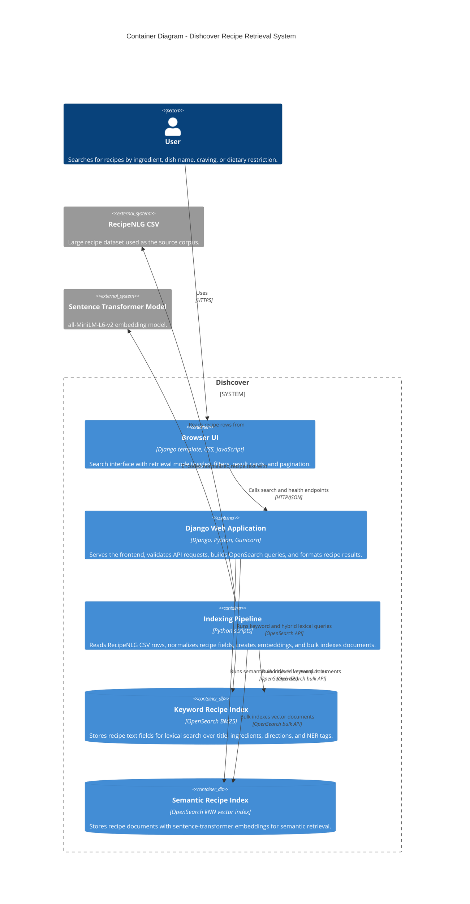

# Dishcover

Dishcover is a scalable recipe retrieval system built with Django and OpenSearch on top of the RecipeNLG dataset. The project helps users find recipes from real cooking intent, such as available ingredients, cravings, dish names, and dietary restrictions.

Live app: https://dishcover-2mlm8.ondigitalocean.app/

## Problem Statement

Recipe search is often harder than exact title lookup. In real life, users usually know partial information:

- "I have chicken, tomatoes, and garlic. What can I cook?"
- "Find a quick spicy dinner."
- "Avoid milk and peanuts."
- "Show recipes similar to rendang."

Dishcover solves this as an information retrieval problem. It indexes a large recipe corpus and supports keyword, semantic, and hybrid retrieval so users can search by exact terms or broader natural-language intent.

## Current Features

- Django web app deployed on DigitalOcean App Platform.
- OpenSearch-backed retrieval over RecipeNLG recipes.
- Keyword search using OpenSearch BM25 over `title`, `ingredients`, `directions`, and `ner`.
- Semantic search using sentence-transformer embeddings stored in an OpenSearch `knn_vector` field.
- Hybrid search using reciprocal rank fusion over keyword and semantic results.
- UI toggle for keyword, semantic, and hybrid retrieval modes.
- Include and exclude ingredient filters.
- Pagination and result size limits.
- Result cards with title, score, tags, ingredients, first direction step, and source link.
- Bulk indexing scripts for keyword and semantic indexes.
- Basic Django tests for API behavior.

## Team

| Name | Student ID | Role |
|------|------------|------|
| Valentino Vieri Zhuo | 2306206446 | OpenSearch Setup and Indexing Pipeline |
| Joshua Montolalu | 2306275746 | Django Backend and Search API |
| Henry Aditya Kosasi | 2306214990 | Frontend, Semantic Search, Deployment, Documentation |

## Dataset

This project uses the [RecipeNLG dataset](https://www.kaggle.com/datasets/paultimothymooney/recipenlg), a large-scale recipe dataset containing more than 2.2 million recipes. The main fields used by Dishcover are:

- `title`
- `ingredients`
- `directions`
- `link`
- `source`
- `NER`

The dataset was created by Poznan University of Technology for natural language generation research.

> Note: RecipeNLG is licensed for non-commercial research and educational use. This project is developed as a university course project and is not intended for commercial use. See the dataset page for the original terms.

## Architecture

The system is organized as a small web application backed by OpenSearch indexes. The Django app serves both the browser UI and the JSON search API, while separate indexing scripts prepare RecipeNLG data for keyword and semantic retrieval.



```text
User Browser
    |
    v
Django Template + Static JS
    |
    v
Django Search API
    |
    v
OpenSearch Managed Database
    |
    +-- recipes keyword index
    +-- recipes_semantic vector index
```

Django is stateless and can be scaled horizontally by adding more app containers. OpenSearch is responsible for retrieval, ranking, pagination, and vector search. The indexing scripts use bulk indexing so the corpus can be loaded in batches instead of one document at a time.

## How Indexing Works

Each RecipeNLG CSV row is indexed as one recipe document.

### Keyword Index

`scripts/index_recipes.py` reads the CSV and sends recipe documents to OpenSearch. OpenSearch tokenizes text fields and builds an inverted index. At query time, BM25 ranks documents based on term matching and field statistics.

```text
CSV row -> recipe document -> OpenSearch text fields -> BM25 retrieval
```

### Semantic Index

`scripts/index_semantic_recipes.py` builds a normalized recipe text from the title, ingredients, NER tags, and early direction steps. The text is encoded with:

```text
sentence-transformers/all-MiniLM-L6-v2
```

The model produces a 384-dimensional dense vector for each recipe. The vector is stored in OpenSearch as a `knn_vector`, allowing nearest-neighbor retrieval by meaning rather than exact word overlap.

```text
CSV row -> recipe document -> normalized recipe text -> embedding vector -> OpenSearch kNN index
```

The query is also encoded with the same model. Semantic search compares the query vector against recipe vectors and returns the nearest recipes.

## Search Modes

### Keyword

Uses BM25 over text fields. This works well for exact ingredients, dish names, and terms that appear directly in the recipes.

Example:

```http
GET /api/search/?q=chicken%20soup&mode=keyword&size=12
```

### Semantic

Encodes the query into a vector and performs OpenSearch kNN search over the semantic index. This works better for natural-language intent and related concepts.

Example:

```http
GET /api/search/?q=quick%20spicy%20chicken%20dinner&mode=semantic&size=12
```

### Hybrid

Runs both keyword and semantic retrieval, then combines rankings using reciprocal rank fusion. This helps preserve exact term matching while also capturing broader semantic similarity.

Example:

```http
GET /api/search/?q=quick%20spicy%20chicken%20dinner&mode=hybrid&size=12
```

## Local Setup

### 1. Clone The Repository

```bash
git clone https://github.com/The-Index-TBI/recipe-retrieval.git
cd recipe-retrieval
```

### 2. Create A Virtual Environment

```bash
python -m venv venv
source venv/bin/activate
```

On Windows:

```powershell
venv\Scripts\activate
```

### 3. Install Dependencies

```bash
pip install -r requirements.txt
```

Semantic search dependencies are included in `requirements.txt`, so no separate semantic requirements file is needed.

### 4. Configure Environment Variables

Copy `.env.example` to `.env` and fill in the values.

Important variables:

```env
DJANGO_SECRET_KEY=your-secret-key
DEBUG=True
ALLOWED_HOSTS=localhost,127.0.0.1

CSV_PATH=path/to/RecipeNLG_dataset.csv

OPENSEARCH_HOST=localhost
OPENSEARCH_PORT=9200
OPENSEARCH_USE_SSL=False
OPENSEARCH_VERIFY_CERTS=False
OPENSEARCH_USERNAME=
OPENSEARCH_PASSWORD=
OPENSEARCH_INDEX=recipes
OPENSEARCH_SEMANTIC_INDEX=recipes_semantic
OPENSEARCH_TIMEOUT=300

SEMANTIC_MODEL_NAME=sentence-transformers/all-MiniLM-L6-v2
SEMANTIC_START_OFFSET=auto
SEMANTIC_INDEX_LIMIT=10000
SEMANTIC_INDEX_BATCH_SIZE=512
SEMANTIC_ENCODE_BATCH_SIZE=128
SEMANTIC_DEVICE=cpu
```

Use `SEMANTIC_DEVICE=cuda` only when the active Python environment has CUDA-enabled PyTorch installed.

### 5. Run OpenSearch Locally

```bash
docker run -d --name opensearch \
  -p 9200:9200 -p 9600:9600 \
  -e "discovery.type=single-node" \
  -e "DISABLE_SECURITY_PLUGIN=true" \
  opensearchproject/opensearch:latest
```

Check OpenSearch:

```bash
curl http://localhost:9200
```

### 6. Index Recipes

Keyword index:

```bash
python scripts/index_recipes.py
```

Semantic index:

```bash
python scripts/index_semantic_recipes.py
```

The semantic script supports:

- `SEMANTIC_START_OFFSET=auto` for resume behavior.
- `SEMANTIC_INDEX_LIMIT` for chunked indexing.
- Bulk indexing with retries.
- Progress logs showing encode time, bulk indexing time, and documents per second.

### 7. Run Django

```bash
python manage.py runserver
```

Open:

```text
http://127.0.0.1:8000/
```

## Deployment Notes

The deployed version uses:

- DigitalOcean App Platform for Django.
- DigitalOcean Managed OpenSearch for the retrieval indexes.

Recommended App Platform run command:

```text
gunicorn core.wsgi:application --bind 0.0.0.0:8080 --workers 1 --threads 2 --timeout 180
```

The longer timeout is important because the first semantic query loads the sentence-transformer model. Using one worker avoids loading the model multiple times in memory.

Recommended production environment variables:

```env
DEBUG=False
ALLOWED_HOSTS=.ondigitalocean.app
OPENSEARCH_HOST=your-managed-opensearch-host
OPENSEARCH_PORT=25060
OPENSEARCH_USE_SSL=True
OPENSEARCH_VERIFY_CERTS=True
OPENSEARCH_USERNAME=your-username
OPENSEARCH_PASSWORD=your-password
OPENSEARCH_INDEX=recipes
OPENSEARCH_SEMANTIC_INDEX=recipes_semantic
OPENSEARCH_TIMEOUT=300
SEMANTIC_MODEL_NAME=sentence-transformers/all-MiniLM-L6-v2
HF_HOME=/tmp/huggingface
TOKENIZERS_PARALLELISM=false
```

## Testing

Run the Django tests:

```bash
python manage.py test
```

The repository also includes GitHub Actions configuration for CI.


## Future Work

Dishcover already demonstrates the core retrieval pipeline, but several improvements would make it more useful as a full recipe discovery product and stronger as an information retrieval system. The next priorities focus on richer recipe exploration, better query assistance, operational observability, and optional multimodal search once the text pipeline is stable.

- Recipe detail page.
- Ingredient autocomplete from frequent NER terms.
- Similar recipe endpoint using vector search.
- Search analytics for query latency and common queries.
- Difficulty and time estimates from recipe text.
- Optional image-assisted recipe search using image labels or CLIP-style embeddings.

## License

This repository is provided for educational coursework. Any use of the RecipeNLG dataset must comply with its original non-commercial research and educational terms.
